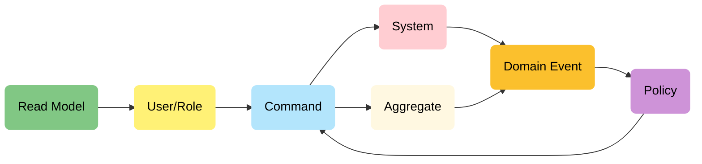
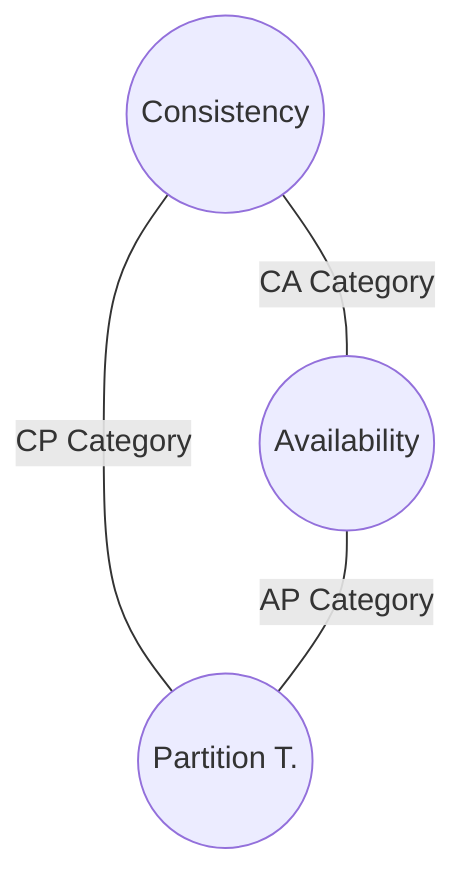
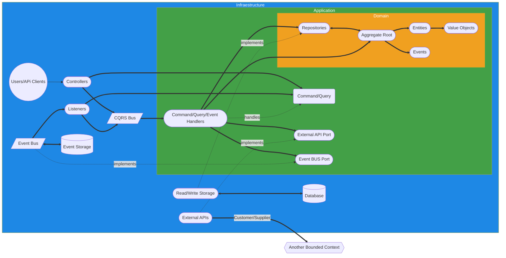
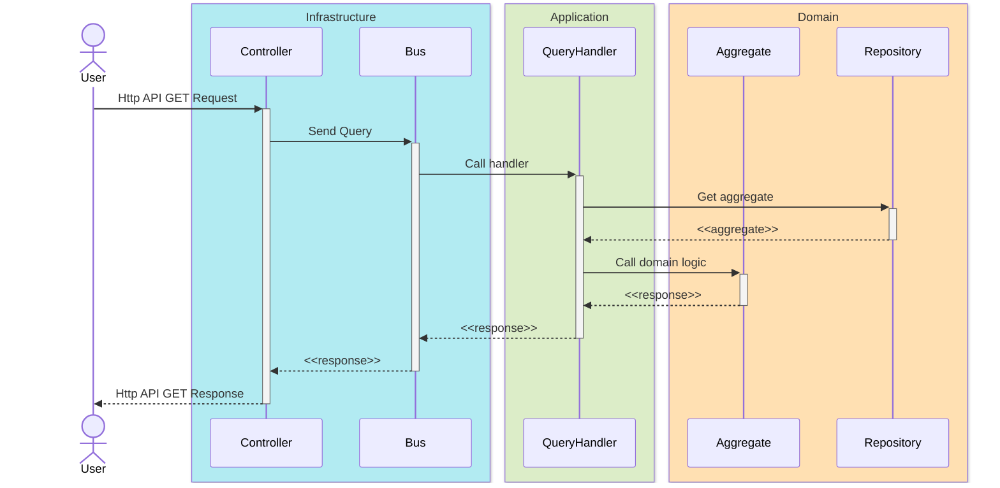
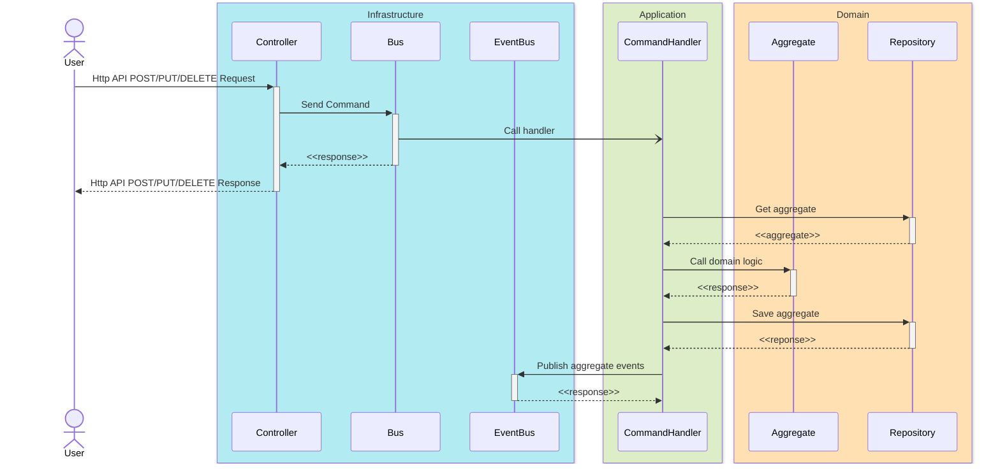
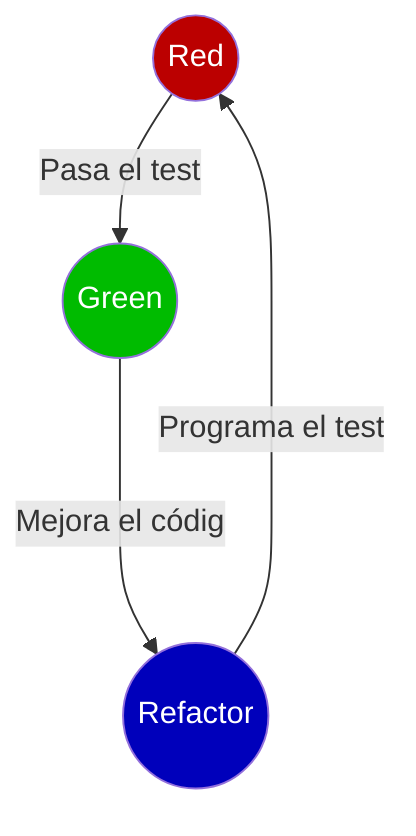

# DDD Repositorio de ejemplo

Este es un repositorio de ejemplo para demostrar conceptos de DDD, Arquitectura Hexagonal y CQRS.

# Domain Driven Design

Aproximación al desarrollo de software complejo.
- Se pone el foco en el dominio del problema y lo traslada al código.
- Se explora dicho dominio en colaboración con los expertos.
- Se habla en un lenguaje ubicuo dentro de un contexto limitado.

Documentación On-line:
- [DDD Reference](https://www.domainlanguage.com/wp-content/uploads/2016/05/DDD_Reference_2015-03.pdf)
- [DDD Crew](https://github.com/ddd-crew)
- [Virtual DDD](https://virtualddd.com/)

Libros:
- [Domain Driven Design](https://www.amazon.com/Domain-Driven-Design-Tackling-Complexity-Software/dp/0321125215)
- [Implementing Domain Driven Design](https://www.amazon.com/Implementing-Domain-Driven-Design-Vaughn-Vernon/dp/0321834577)
- [Domain Driven Desgin Distilled](https://www.amazon.com/Domain-Driven-Design-Distilled-Vaughn-Vernon-ebook/dp/B01JJSGE5S)
- [Patterns, Principles & Practices of DDD](https://www.amazon.com/Patterns-Principles-Practices-Domain-Driven-Design/dp/1118714709)
- [Leaning Domain Driven Design](https://www.amazon.com/Learning-Domain-Driven-Design-Aligning-Architecture/dp/1098100131)

## Diseño estratégico

En el diseño estratégico se trata de modelar el espacio del problema sin entrar a ninguna solución técnica, de manejan los conceptos de:
- **Domain**: El dominio del problema, limitado por el lenguaje ubicuo. No es igual el concepto expediente en el dominio de gestión académica que en el de administración electrónica. Debes clasificar los dominios encontrados según:
    - *Generic Domain*: Dominio genérico, presente en muchas otras organizaciones de todo tipo, puede externalizarse sin personalización, recursos humanos, contabilidad, marketing,...
    - *Supported Domain*: Dominio de soporte, más cercano al core del negocio, parcialmente externalizable, gestión académica, estudios propios,...
    - *Core Domain*: Dominio en el que debes concentrar todos tus esfuerzos ya que marca la diferencia con tus competidores
- **Lenguaje ubicuo**: Consensuado con los expertos del dominio si ellos lo llaman expediente la clase que lo modele debe llamarse igual, incluso parámetros URL de llamadas. Si detecto el mismo concepto expediente con diferente uso está claro que son dominios diferentes
- **Bounded context**: Donde cobra sentido el lenguaje utilizado, un subsistema en el que se aplica un modelo particular con una infraestructura dedicada, unos límites definidos y bajo la responsabilidad de un único equipo (autónomo)
- **Context mapping**: Relación entre los diferentes contextos, cuando tenga que relacionar dos contextos lo voy a hacer con mecanismos que determinarán mi grado de dependencia entre contextos y a su vez la relación entre los equipos responsables
    - *Customer/Supplier*: Relación proveedor/cliente cooperativa, con atención al cliente
    - *Open/Host Service*: Como el anterior pero con un lenguaje publicado (varios clientes), no hay dedicación al cliente
    - *Conformist*: Una relación en la que el cliente comparte el modelo no lo adapta, usa sus términos de lenguaje
    - *Anticorruption Layer*: Modelo del cliente aislado con un adaptador para traducción suele usarse para aislar legacy code
    - *Shared kernel*: Se comparte parte del modelado del dominio (código o tal vez la BD)
    - **Relación entre equipos**
        - *Upstream/Downstream*: Cuando un equipo (DW) es cliente de otro (UP) y puede verse afectado por sus cambios
        - *Mutually dependent*: Cuando existe dependencia en ambos sentidos entre los equipos
        - *Free*: Cuando los equipos no tienen dependencias

Existen algunas técnicas para llegar a extraer los bounded contexts y relaciones dentro de nuestro dominio.

### Event storming

Se empieza detectando los eventos de dominio para continuar recuperando los comandos (que originan los eventos) y los sistemas o agregados que procesan esos comandos (y generan los eventos). Los comandos pueden ser ejecutados por unos determinados usuarios o roles o por políticas procesadas a partir de los eventos generados. Tanto en un caso como otro puede ser necesario disponer de datos para tomar las decisiones que permitan lanzar los comandos.



## Diseño táctico

Una vez localizados los subdominios o bounded contexts debes plasmar en código los conceptos del lenguaje ubicuo utilizando diferentes conceptos:

- **Entity**: Esto no necesita mucha explicación, se trata de un elemento que tiene entidad y que lleva asociadas acciones de buscar, recuperar, guardar (datos + comportamiento)
    - *Persona*: El ejemplo habitual, si una persona cambia de DNI sigue siendo la misma persona. Aquí se ve claro el error cometido al modelar la entidad persona del dominio en nuestra base de datos, el DNI no es el identificador de esta entidad
- **Value Object**: Son objetos que no se comportan como entidades, puedo reemplazar un objeto por otro con los mismos atributos y no pasa nada. Además son inmutables si cambian se crean objetos nuevos.
    - *Dirección*: Este objeto con calle, número, código postal puedo reemplazarlo por otro con los mismos valores y no pasa nada. Si la dirección cambia no cambio la calle o el número, debo crear otro objeto dirección
- **Aggregate**: Se encargan de transaccionar el estado del sistema, pueden ser compuestos por una única entidad o por varias. Cuando lo conforman varias una de las entidades actúa como root y todas las interacciones son a través de ella
    - *Pedido y línea de pedido*: En este caso ambas entidades podrían formar un agregado y pedido actuaría como root, no necesito crear una clase AgregadoPedido la propia clase Pedido es la raíz del agregado
- **Repositorios**: Encargados de persistir y recuperar el estado de un agregado
- **Factorías**: Para crear las entidades del dominio (no usar new)
- **Eventos**: Hechos inmutables que publican los agregados al modificar su estado. Se escriben en pasado y se pueden persistir en un event hub
- **Comandos**: Acciones inmutables que desencadenan cambios en uno o más agregados. Se escriben en infinitivo y se transmiten por eventos o llamadas API rest
- **Servicios**: Cuando no está claro en qué entidad implementar el caso de uso se puede recurrir a un elemento auxiliar, pero no debe caerse en implementar todo en clases "servicio"

### Value Object

La idea es garantizar la integridad de estos objetos desde el momento en el que se crean, si una vez creados no se modifican estoy seguro de que serán siempre válidos. Debo huir de usar tipos primitivos para usar tipos específicos:
- Incluye la inmutabilidad si el tipo original no la incluye
- Controlo en el constructor todas las restricciones sobre el atributo: La longitud, el formato, los rangos, etc…
- No se exponen detalles de la implementación de mi dominio al exterior, retorna el valor con un método value que devuelve un tipo elegido, puedo cambiar el almacenamiento interno sin afectar a nada, haciendo la conversión en el método value
- Se convierten en un imán para encapsular lógica asociada a ellos
- Depende del contexto un billete puede ser una entidad o un value object

### Agregados

Hemos dicho que son los encargados de transaccionar el estado por lo que esta será la clave a la hora de decidir si varias entidades forman un agregado o no:
- **Invariante**: Si existe una regla que vincula ambos objetos que debe cumplirse obligatoriamente en todo momento conformarán un agregado
- **Consistencia eventual**: Siempre que pueda permitirme la consistencia eventual optaré por ella porque ayuda al rendimiento y simplifica
- **Negocio/UI**: Si el negocio me obliga a que dos elementos de la UI no puedan mostrarse nunca temporalmente inconsistentes tendré un agregado

Por regla general un caso de uso (una petición) solo debe incluir transacciones de un único agregado, si tienes casos de uso que modifican muchos agregados algo anda mal. Cada agregado tendrá su repositorio para gestionar su persistencia (incluso separado R/W). Además se encargan de publicar los eventos registrados a lo largo de su ejecución. Un bounded context puede contener varios agregados pero lo lógico será ubicarlos en módulos diferenciados, el secreto es mantenerse pequeño y respetar location transparency (no hacer suposiciones sobre la ubicación de un agregado puede estar en una API remota)



No es posible tener un sistema de base de datos distribuido que garantice las tres propiedades al mismo tiempo, solo se pueden garantizar dos:
- **Consistencia**: Capacidad de retornar siempre los datos más actualizados presentes en el sistema
- **Disponibilidad**: Capacidad de responder siempre satisfactoriamente a las peticiones de lectura sobre el sistema sin importar la consistencia de los datos
- **Tolerancia a particionamiento**: Se tolera sin perder funcionalidad una situación de falta de comunicación en parte del sistema

Esto nos deja ante la posibilidad de construir sistemas de datos distribuidos de 3 tipos:
- **CA Category**: Estos sistemas son inaceptables puesto que no es posible asumir que no vas a tener problemas de comunicación en un sistema distribuído, es lo que ocurre con las bases de datos tradicionales cuando intentas distribuir transacciones si un nodo cae la transacción completa falla
- **CP Category**: Se ofrece consistencia y tolerancia al particionamiento, ante un fallo de comunicación el sistema puede bloquearse o provocar esperas muy largas con objeto de garantizar la consistencia
- **AP Category**: No se garantiza la consistencia para permitir la tolerancia a fallos de comunicación y mantener el funcionamiento completo del sistema sin necesidad de bloqueos o esperas largas

Al final al construir un sistema distribuido realmente tienes que decidir entre dos opciones puesto que en cualquier caso debes ofrecer siempre la tolerancia al particionamiento, debes elegir qué garantizar además:
- **Consistencia**: Es lo que hemos hecho hasta ahora nuestros sistemas ante incomunicaciones se ven afectados lo más importante era siempre la consistencia tener los datos actualizados en cualquier lugar
- **Disponibilidad**: Es lo que pretendemos hacer a futuro, empezar a tolerar el empleo de datos ligeramente desactualizados para hacer sistemas disponibles en todo momento sin bloqueos ni esperas puesto que en los entornos en la nube y con microservicios hay multitud de comunicaciones y es mucho más probable que fallen

En cualquier caso cualquiera de estos sistemas garantiza "virtualmente" la propiedad que sacrifica mientras las comunicaciones estén presentes, es solo cuando estas comunicaciones fallan cuando se hace notar la falta de la característica sacrificada

# Arquitectura Hexagonal

Arquitectura limpia ideal para reflejar los límites entre el dominio y la infraestructura. Los conceptos tácticos vistos en DDD encajan a la perfección en ella. Se basan en crear capas concéntricas:
- Situando el dominio en la capa más interior
- La infraestructura en la capa más exterior
- **No permitiendo dependencias de capas internas hacia capas externas**

Se obtienen varios beneficios:
- La lógica de negocio se mantiene al margen de cuestiones tecnológicas
- Maximiza la portabilidad haciendo más sencillo adaptar cambios tecnológicos

Los puntos de interconexión con otros bounded context son claros:
- El sistema recibe interacciones del exterior:
    - A través de los clientes de sus APIs (Usuarios usando aplicaciones frontend u otros contextos invocando desde clientes máquina)
    - A través de los listener de eventos pueden ser locales (generados por el propio dominio o por otros)
- El sistema envía interacciones al exterior:
    - Mediante conexiones directas a APIs remotas
    - Mediante la generación de eventos enviados al bus
    - A través de los datos debido a que existen proyecciones de tablas que se actualizan por algún mecanismo

**IMPORTANTE: En ningún caso vamos a querer que las interacciones con otros sistemas se hagan compartiendo directamente los mismos datos de la misma base de datos, grants, pl/sql,...**

La intención es mantener al máximo la autonomía de cada bounded context para que puedan evolucionar de forma independiente y las fricciones entre los equipos responsables de cada uno sean mínimas.



## Controladores de entrada

Normalmente será una pieza siempre presente que se encarga de:
- Recuperar los datos de la interfaz de usuario (generalmente recibidos en una petición http)
- Construir el comando o la query que corresponda según la acción demandada (este proceso puede incluir validaciones de los datos de entrada)
- Lanzar el comando o query construído al bus
- Si el bus es síncrono esperar la respuesta para poder transformarla a DTOs específicos esperados por el cliente y retornarla al mismo

Normalmente los buses de queries serán siempre síncronos y los del comandos es preferible que no lo sean y por tanto no retornen datos. Si es imprescindible en algún caso retornar datos en un comando deberán hacerse buses síncronos y puede suponer problemas en caso de que los comandos quieran moverse a ejecución vía API Rest u otras estrategias que introduzcan latencias altas en la respuesta.

## Estructura de carpetas

En el proyecto puedes alojar diferentes módulos de tu dominio, no tienes porque mezclarlos. Se utiliza una carpeta **shared** para alojar el código común a todos los módulos *shared kernel*, incluye clases útiles.

- <span style="color:#1E88E5">**ADAPTERS**</span>: Carpeta de capa de infraestructura, incluye los adaptadores de interfaces definidas para satisfacer las necesidades de entrada/salida del dominio para determinadas soluciones técnicas. Una carpeta por implementación
    - **JPA**: Implementación JPA de los repositorios necesarios para almacenamiento
    - **REST**: Implementación con SpringBoot de Controladores REST
    - **Otros**: En el ejemplo fake y location son implementaciones mock de servicios
- <span style="color:#43A047">**APPLICATION**</span>: Carpeta de capa de aplicación, incluye comandos, queries y servicios
    - **Command**: Carpeta con la definición de los comandos y los manejadores de cada uno
    - **Query**: Carpeta con la definición de las queries y los manejadore de cada una
    - **Service**: Incluye servicios de más alto nivel que los servicios de dominio para resolver necesidades de los manejadores 
- <span style="color:#F0A020">**DOMAIN**</span>: Carpeta de capa de dominio, incluye el modelo (agregados, entidades y value objects), eventos, factorías, políticas, repositorios y servicios.
    - **Event**: Eventos del dominio
    - **Factory**: Factorías para crear los objetos del dominio
    - **Modelo**: Aloja entidades y value objects, una de las entidades debe ser el agregado raíz
    - **Policy**: Políticas con patrón estrategia para resolver decisiones de la lógica del dominio
    - **Repository**: Interfaces de repositorio necesarias para recuperar agregados del dominio

# CQRS

Es el siguiente paso hacia la independencia, separar consultas de modificaciones:
- Puedo escalar de forma separada y crear modelos específicos para cada caso
- Se aumenta la seguridad un fallo en la parte de lectura no me provoca modificaciones
- Puede que solo necesite escrituras en el backoffice
- Puedo resolver problemas de API Composition, de una forma más optimizada, utilizando llamadas al BUS en lugar de vía HTTP
- Puedo aplicar decoradores a todos mis comandos por la firma común del handler, recopilar métricas o auditar por ejemplo

## Command/Query BUS

Un bus no es más que una abstracción de una colección de manejadores con la lógica necesaria para encaminar un determinado comando/query al handler adecuado (único por comando/query)

El controlador de entrada correspondiente será el encargado de recuperar los datos de la interfaz de entrada necesario, crear el comando necesario y enviarlo al bus. En caso de tratarse de un bus síncrono será capaz de retornar los datos devueltos por el comando o la query. Se recomienda utilizar buses asíncronos en comandos siempre que sea posible.

## Query

- Un simple DTO que sirve para trasladar al dominio la intención de obtener datos
- Retorna un resultado sin provocar efectos secundarios normalmente de forma síncrona
- El controlador de entrada lanza ese DTO al query bus y este lo remite al handler
- El **query handler** se encarga de:
    - Traducir los datos de entrada de la query a entidades/value objects del dominio
    - Recuperar los agregados y entidades necesarias utilizando los repositorios
    - Invocar a la lógica de negocio del agregado raíz para ejecutar la query y retornar el resultado
    - No es necesario persistir el agregado ni publicar eventos (no hay mutación del sistema)



## Command

- Un simple DTO que sirve para trasladar al dominio la intención de ejecutar una acción
- No retorna nada (void) sólo provoca un efecto secundario normalmente asíncrono (bus)
- El controlador de entrada lanza ese DTO al command bus y este lo remite al handler
- Puedo asumir picos de carga mejor si utilizo un bus asíncrono
- Debemos procurar su idempotencia *f(f(x)) = f(x)* siempre que sea posible (obligatorio para PUT/DELETE)
- El **command handler** se encarga de:
    - Traducir los datos de entrada del comando a entidades/value objects del dominio
    - Recuperar los agregados y entidades necesarias utilizando los repositorios
    - Invocar a la lógica de negocio del agregado raíz para ejecutar el comando 
    - Persistir el estado del agregado raíz para preservar el cambio de estado provocado por el comando
    - Publicar los eventos producidos por el agregado raíz una vez que se ha persistido con éxito



## Identificadores y validaciones

- Hemos mencionado que los comandos no retornan datos permitiendo así su asincronía
- ¿Cómo conoce el cliente el ID del recurso que acaba de crear con un comando?
    - Lo más simple es que el ID sea un valor más a facilitar por el cliente
    - Olvidar las secuencias o autoincrementados como identificadores
    - Utilizar UUIDs fáciles de crear en cualquier cliente y lenguaje
    - Se facilitan los test unitarios y mi generación no depende de la infraestructura 
    - Complicas la explotación de los fallos de seguridad broken access control
    - Obviamente habrá casos en los que deberé adaptarme a IDs generados en la base de datos, usar comandos síncronos
- Por la misma razón si quiero retornar al controller errores de datos de entrada debo de hacer validaciones por duplicado
    - Validar en la conversión de datos del comand/query handler (impide introducir datos inválidos al dominio)
    - Duplicar la validación en la creación de las queries y commands, para poder retornar errores a los usuarios aún usando bus asíncrono de comandos o para agrupar múltiples errores en uno

# Testing

Existen varios tipos de tests:
- **Estáticos**: Proporcionados por los analizadores estáticos de código (linters, sonarqube,...)
- **Unitarios**: Prueban el caso de uso directamente mockeando toda la infraestructura, valida la lógica del caso de uso y la colaboración con los adaptadores de salida
- **Integración**: Prueban las implementaciones de la infraestructura de salida (normalmente repositorios)
- **Aceptación/E2E**: Prueba todo desde el punto de vista del adaptador de entrada

Para dar soporte a los tests dispones de diferentes tipos de dobles de tests:
- **Dummy**: Usado para satisfacer dependencias sin relevancia para la ejecución
- **Stub**: Implementación alternativa a la real con unos valores fijos predeterminados
- **Spy**: Utilizada para comprobar si nuestro código invoca a cierto método de la interface
- **Mock**: Combina las características de stub y spy puede retornar valores según la entrada
- **Fake**: Una implementación completa con lógica de negocio (ej. una InMemoryDB)

## Test Unitarios

En nuestro caso el objetivo sería probar el funcionamiento de los command y query handler, debes usar un doble para cualquier servicio que requieran infraestructura, y comprobar en todo caso las interacciones. Estarías probando capa de aplicación y dominio.

De este modo evitas que un cambio en la implementación de un adaptador concreto rompa los tests unitarios, y tampoco estás obligado a modificarlos si añades una implementación nueva a una interfaz existente.

### TDD

Hacer los tests antes que el código de producción. Si no tienes un test no sabes qué debe hacer tu código de producción.

Reglas principales:
- **No escribirás código de producción sin escribir un test antes que falle**
- **No escribirás más de un test unitario suficiente para fallar**
- **No escribirás más código del necesario para pasar el test**



Fases:
- **Red**: Escribir un test que falle, normalmente unitario pero puede ser de integración
- **Green**: Implementar el código mínimo para que el test pase
- **Refactor**: Una vez que el test pasa estás en posición de optimizar el código y mejorarlo
    - La fase realmente importante, nadie hace código bien a la primera
    - Tener tests permite abordar refactorizaciones para mejorar el código y mejorar su mantenibilidad

Estrategias de rojo a verde (hay muchas más):
- **Implementación falsa**: Empiezas retornando las constantes para los casos de prueba y poco a poco deduces el algoritmo necesario que funciona para el caso general
- **Implementación obvia**: Cuando tienes problemas muy obvios puedes optar por implementar la solución directamente
- **Triangulación**: Se mezcla una implementación obvia del caso más simple con implementaciones falsas de los más complejos hasta obtener la implementación final

Patrón Object Mother:
- Cuando escribes tests es complicado mantener la semántica y no perderte entre el código que prepara o prueba los diferentes casos de uso
- Crea factorías semánticas para evitarlo, por ejemplo un método factoría "crearUsuarioMayorDeEdad" deja clara la intención de la prueba

## Test Integración

Se trata de probar las diferentes implementaciones de infraestructura utilizadas, ya sean repositorios o APIs externas. Lo normal es probar las implementaciones de salida, las de entrada se pueden hacer en los test de aceptación.

La gran ventaja es que cuando añades o modificas un adaptador solo se ven afectados estos tests unitarios.

## Test Aceptación

Se trata de probar todo de principio a fin, en principio sin usar dobles de tests pero claramente en la parte de la persistencia no siempre es viable. El principal objetivo es testear los adaptadores de entrada (controladores rest). Se puede utilizar sintaxis gherkin para utilizarlos como documentación de tu servicio.

### Acceptance TDD

- Trata de utilizar los tests de aceptación como documentación viva
- Dentro de un ciclo de ATDD en la fase de desarrollo de la especificación habría uno o varios ciclos TDD
- Los tests a escribir parten de las historias de usuario (Example Mapping)
- Los tests se escriben con términos del lenguaje ubicuo entendible por expertos del dominio
- Utiliza el lenguaje gherkin (cucumber)
    - **Característica**: Funcionalidad a probar
    - **Escenario**: Escenario a probar (ejemplo/caso de uso) 
    - **Dado**: Pre-condición inicial
    - **Cuando**: Acción sobre el sistema
    - **Entonces**: Post-condición final
    - **Y, Pero**: Para mayor legibilidad

# Code

Y ahora vamos a ver fragmentos de código en los que todo esto se aplica:

```
Requisitos del ejemplo: Se trata de un ejemplo muy básico, simplemente es un CRUD de usuarios, en los que se puede registrar solo a mayores de edad. Los usuarios tienen ID, Nombre, Edad y País de origen. Además para cada usuario se almacenan sus preferencias de redes sociales el nombre y una valoración de 0 a 10 según les guste más o menos. Por defecto, para usuarios menores de 29 años se establecen unas preferencias que valoran con 0 facebook mientras que para los mayores de 28 se valora con 0 tiktok. El resto de redes se valoran proporcionalmente a la edad según se consideran más o menos destinadas a jóvenes.

Inicialmente todas las operaciones ejecutadas sólo se permiten para administradores del sistema.
```

## Test de aceptación (Query)

Los podemos escribir en un archivo *feature* en formato gherkin: [Ver archivo](https://github.com/juanjmerono/faker/blob/master/src/test/resources/features/users/users.feature)

### Características y antecedentes

- **Característica**: El nombre general para la característica que estás evaluando
- **Antecedentes**: Parte del proceso común a todos los escenarios

```gherkin
Característica: Usuarios

  Antecedentes: Disponemos de una API de usuarios
    Dado una API ubicada en "/faker/v1/user"
```

### Escenario

- **Escenario**: Describe la prueba concreta que estás haciendo
- **Dado**: La precondición del escenario
- **Cuando**: La acción que se ejecuta para la prueba del escenario
- **Entonces**: La postcondición del escenario
- **Y, Pero**: Dan soporte a cualquiera de las otras tres para aportar mayor legibilidad

Adicionalmente se pueden anotar con @tags los escenarios para luego facilitar su búsqueda o ejecución parcial de determinados casos de uso.

```gherkin
  Escenario: Obtener un listado inicial de usuarios sin autenticar
    Dado un usuario no autenticado
    Cuando trata de obtener un listado de usuarios
    Entonces obtiene un error de autenticación

  Escenario: Obtener un listado inicial de usuarios autenticado sin autorización
    Dado el usuario autenticado "user@acme.es"
    Cuando trata de obtener un listado de usuarios
    Entonces obtiene un error de autorización

  Escenario: Obtener un listado inicial de usuarios autenticado con autorización
    Dado el usuario autenticado "admin@acme.es"
    Cuando trata de obtener un listado de usuarios
    Entonces obtiene una respuesta correcta
    Y la lista de usuarios no está vacía
```

Esto se lleva a una clase que traduce las diferentes cadenas empleadas en la sintaxis gherkin a código: [Ver archivo](https://github.com/juanjmerono/faker/blob/master/src/test/java/es/um/atica/faker/users/cucumber/CucumberSteps.java)

#### Precondiciones

```java
    @Dado("una API ubicada en {string}")
    public void existingAPIPath(String path) {
        apiPath = path;
    }

    @Dado("un usuario no autenticado")
    public void usuarioNoAutenticado() {
        jwt = new RequestPostProcessor(){
            @Override
            public MockHttpServletRequest postProcessRequest(MockHttpServletRequest request) {
                // Nothing to to
                return request;
            }  
        };
    }

    @Dado("el usuario autenticado {string}")
    public void usuarioAutenticado(String authUser) {
        jwt = SecurityMockMvcRequestPostProcessors.jwt()
                .jwt(u->u.subject(authUser))
                .authorities(new SimpleGrantedAuthority(VALID_SCOPE));
    }
```

#### Acciones

```java
    @Cuando("trata de obtener un listado de usuarios")
    public void listadoUsuariosGET() throws Exception {
        mvcResult = mvc.perform(MockMvcRequestBuilders.get(apiPath)
            .with(jwt)
            .accept(MediaType.APPLICATION_JSON_VALUE)).andReturn();
    }
```

#### Postcondiciones

```java
    @Entonces("obtiene un error de autenticación")
    public void obtieneUnauthorized() throws Exception {
        assertEquals(401,mvcResult.getResponse().getStatus());
    }

    @Entonces("obtiene un error de autorización")
    public void obtieneForbidden() throws Exception {
        assertEquals(403,mvcResult.getResponse().getStatus());
    }

    @Entonces("obtiene una respuesta correcta")
    public void obtieneOk() throws Exception {
        assertEquals(200,mvcResult.getResponse().getStatus());
    }

    @Y("la lista de usuarios no está vacía")
    public void notEmptyList() throws Exception {
        CollectionModel<EntityModel<UserDTO>> userList = objectMapper.readValue(
            mvcResult.getResponse().getContentAsString(), 
            new TypeReference<CollectionModel<EntityModel<UserDTO>>>() {}
        );
        assertTrue(userList.getContent().size()>0);
    }
```

## Controller (Infrastructure)

Ahora que tenemos al menos un test que falla podemos empezar a escribir código de producción, y lo primero es empezar por el controlador: [Ver archivo](https://github.com/juanjmerono/faker/blob/master/src/main/java/es/um/atica/faker/users/adapters/rest/UsersQueryRestController.java)

En principio creo un controlador para las consultas separado del controlador para los comandos y decido incluir dos conceptos adicionales:
- **Documentación**: Anotaciones OpenAPI para poder proporcionar la documentación correcta de la API
- **Paginación**: Preveo que el listado completo de usuarios puede ser muy extenso por lo que me interesa paginarlo
- **Hateoas**: Mi respuesta debe incluir información adicional para el cliente respecto a la paginación página en la que está, como avanzar o retroceder de página. Para eso se hace uso de *hateoas* que me permite encapsular mi respuesta en un json que añade información extra a los elementos como es la paginación o pueden ser enlaces para otras acciones como eliminar, actualizar o crear más usuarios

### Query Rest Controller

Sus tareas son sencillas:
- Verificar que el usuario invocante tiene permisos para ejecutar la acción
- Recuperar los datos de entrada (en este caso la petición http)
- Construir la query correspondiente (GetUsersQuery)
- Lanzar la query al bus síncrono y retornar la respuesta obtenida convertida previamente a objetos DTO específicos para el cliente

```java
package es.um.atica.faker.users.adapters.rest;

@RestController
@RequestMapping(value="/faker/v1")
public class UsersQueryRestController {
    
    private static final String PAGE_SIZE = "5";

    @Autowired
    private QueryBus queryBus;

    @Autowired
    private UsersModelAssembler usersModelAssembler;

    @GetMapping("/user")
    @PreAuthorize("hasPermission(#jwt, 'GET_USERS')")
    public CollectionModel<EntityModel<UserDTO>> allUsers(@AuthenticationPrincipal Jwt jwt,
        @RequestParam(name="page",required = false, defaultValue = "0") int page,
		@RequestParam(name="size",required = false, defaultValue = PAGE_SIZE) int page_size) throws Exception {
        Page<User> pageUser = (Page<User>)queryBus.handle(GetUsersQuery.of(page,page_size));
        return usersModelAssembler
            .toCollectionModel(
                new PageImpl<UserDTO>(StreamSupport.stream(pageUser.spliterator(), false)
                        .map(UserDTO::of)
                        .collect(Collectors.toList()),
                    pageUser.getPageable(),
                    pageUser.getTotalElements()));
    }

}
```

<details>

<summary>Extra: Hateoas Model Assembler</summary>

#### Model Assembler

Esta es la pieza que permite "ajustar" los datos *hateoas* que se incorporan a la respuesta: [Ver archivo](https://github.com/juanjmerono/faker/blob/master/src/main/java/es/um/atica/faker/users/adapters/rest/UsersModelAssembler.java)

```java
package es.um.atica.faker.users.adapters.rest;

@Component
public class UsersModelAssembler implements RepresentationModelAssembler<UserDTO,EntityModel<UserDTO>> {
    
    private static final String BASE_PATH = "/faker/v1/user";

    @Autowired
    private PagedResourcesAssembler<UserDTO> pagedResourcesAssembler;

    @Override
    public EntityModel<UserDTO> toModel(UserDTO entity) {
        return EntityModel.of(entity,
            linkTo(UsersQueryRestController.class).slash(BASE_PATH + entity.getId()).withSelfRel(),
            linkTo(UsersCommandRestController.class).slash(BASE_PATH + entity.getId()).withRel("put"),
            linkTo(UsersCommandRestController.class).slash(BASE_PATH + entity.getId()).withRel("delete"));
    }

    @Override
    public CollectionModel<EntityModel<UserDTO>> toCollectionModel(Iterable<? extends UserDTO> entities) {
        PagedModel<EntityModel<UserDTO>> model = pagedResourcesAssembler.toModel((Page)entities, this);
        try {
            model.add(linkTo(methodOn(UsersCommandRestController.class).createUser(null, null, null, null)).withRel("post"));
        } catch (Exception ex) {}
        return model; 

    }

}
```

</details>

## Query Handler

Ahora necesitamos la definición de la *Query*. [Ver archivo](https://github.com/juanjmerono/faker/blob/master/src/main/java/es/um/atica/faker/users/application/query/GetUsersQuery.java)

```java
package es.um.atica.faker.users.application.query;

public class GetUsersQuery extends Query<Iterable<User>> {
    private int page;
    private int pageSize;

    private GetUsersQuery(int page, int pageSize) {
        this.page = page; this.pageSize = pageSize;
    }
    public static GetUsersQuery of(int page, int pageSize) {
        return new GetUsersQuery(page,pageSize);
    }

    public int getPage() { return page; }
    public int getPageSize() { return pageSize; }
}
```

Y el manejador *QueryHandler* que la procesa. [Ver archivo](https://github.com/juanjmerono/faker/blob/master/src/main/java/es/um/atica/faker/users/application/query/GetUsersQueryHandler.java)

La tarea del manejador es muy simple en este caso:
- Recupera las entidades del servicio de usuarios usando los datos recibidos de la query
- No requiere ninguna lógica adicional, si fuese necesaria debería estar en el agregado raíz del dominio

**IMPORTANTE: En este caso no se llama al repositorio y se hace uso de un servicio esto es porque se considera que la paginación no es un concepto del dominio y no tiene sentido trasladar al dominio conceptos como página y tamaño de página, que son utilizados en este caso concreto por circunstancias particulares**

Un proceso background que pueda demorarse mucho en responder podría llegar a solicitar la lista completa de usuarios sin paginar

```java
package es.um.atica.faker.users.application.query;

@Component
public class GetUsersQueryHandler implements QueryHandler<Iterable<User>,GetUsersQuery> {

    @Autowired
    private UsersPaginatedReadService usersService;

    @Override
    public Iterable<User> handle(GetUsersQuery query) throws Exception {
        return usersService.findAllUsers(query.getPage(),query.getPageSize());
    }
}
```

## Service

Ahora nos queda el servicio que simplemente será una interface para determinar las necesidades de paginación: [Ver archivo](https://github.com/juanjmerono/faker/blob/master/src/main/java/es/um/atica/faker/users/application/service/UsersPaginatedReadService.java)

```java
package es.um.atica.faker.users.application.service;

import es.um.atica.faker.users.domain.model.User;

public interface UsersPaginatedReadService {
 
    // Los conceptos de página y tamaño de página no pertenecen al dominio
    public Iterable<User> findAllUsers(int page, int pageSize);
    
}
```

## Service Implementation (Infrastructure)

La implementación corre a cargo de la infraestructura: [Ver archivo](https://github.com/juanjmerono/faker/blob/master/src/main/java/es/um/atica/faker/users/adapters/jpa/DBUsersPaginatedReadRepository.java)

```java
package es.um.atica.faker.users.adapters.jpa;

@Service
@org.springframework.context.annotation.Primary
public class DBUsersPaginatedReadRepository implements UsersPaginatedReadService {

    @Autowired
    private JPAUsersReadRepository jpaUsersReadRepository;

    @Override
    public Iterable<User> findAllUsers(int page, int pageSize) {
        return jpaUsersReadRepository.findAll(PageRequest.of(page,pageSize)).map(UserEntity::toModel);
    }

}
```
Haciendo uso de un repositorio de BD JPA: [Ver archivo](https://github.com/juanjmerono/faker/blob/master/src/main/java/es/um/atica/faker/users/adapters/jpa/JPAUsersReadRepository.java)

```java
package es.um.atica.faker.users.adapters.jpa;

import org.springframework.data.repository.PagingAndSortingRepository;
import org.springframework.stereotype.Repository;

@Repository
public interface JPAUsersReadRepository extends PagingAndSortingRepository<UserEntity,String>{
    
}
```

## Test de aceptación (Command)

Ahora vamos a ver un comando que tiene más trabajo que hacer.

### Escenario

Se incluyen solo parte de los tests a ejecutar y los antecedentes son compartidos con los anteriormente vistos en la query.

```gherkin
  Escenario: Crear un usuario autenticado con autorización
    Dado el usuario autenticado "admin@acme.es"
    Cuando trata de crear el usuario "30497182-c376-11ed-afa1-0242ac120001" con nombre "Pepe Lopez" y 18 años
    Entonces obtiene una respuesta correcta
    Y el usuario con id "30497182-c376-11ed-afa1-0242ac120001" es creado

  Escenario: Crear un usuario sin nombre autenticado con autorización
    Dado el usuario autenticado "admin@acme.es"
    Cuando trata de crear el usuario "30497182-c376-11ed-afa1-0242ac120003" con nombre "          " y 18 años
    Entonces obtiene una respuesta de argumento ilegal "User name could not be empty!"
    Y el usuario con id "30497182-c376-11ed-afa1-0242ac120003" no es creado

  Escenario: Crear un usuario menor de edad autenticado con autorización
    Dado el usuario autenticado "admin@acme.es"
    Cuando trata de crear el usuario "30497182-c376-11ed-afa1-0242ac120003" con nombre "Pepe Lopez" y 10 años
    Entonces obtiene una respuesta de argumento ilegal "User age could not be below 18!"
    Y el usuario con id "30497182-c376-11ed-afa1-0242ac120003" no es creado

  Escenario: Crear un usuario que ya existe autenticado con autorización
    Dado el usuario autenticado "admin@acme.es"
    Cuando trata de crear el usuario "30497182-c376-11ed-afa1-0242ac120002" con nombre "Pepe Lopez" y 18 años
    Entonces obtiene una respuesta de elemento existente
    Y el usuario con id "30497182-c376-11ed-afa1-0242ac120003" no es creado
```

Esto se lleva a una clase que traduce las diferentes cadenas empleadas en la sintaxis gherkin a código: [Ver archivo](https://github.com/juanjmerono/faker/blob/master/src/test/java/es/um/atica/faker/users/cucumber/CucumberSteps.java)

#### Precondiciones

```java
    @Dado("el usuario autenticado {string}")
    public void usuarioAutenticado(String authUser) {
        jwt = SecurityMockMvcRequestPostProcessors.jwt()
                .jwt(u->u.subject(authUser))
                .authorities(new SimpleGrantedAuthority(VALID_SCOPE));
    }
```

#### Acciones

```java
    @Cuando("trata de crear el usuario {string} con nombre {string} y {int} años")
    public void createUsuarioPOST(String id, String name, int age) throws Exception {
        UserDTO usr = UserDTO.builder().id(id).name(name).age(age).build();
        mvcResult = mvc.perform(MockMvcRequestBuilders.post(apiPath+"/"+id)
            .with(jwt)
            .contentType(MediaType.APPLICATION_JSON_VALUE)
            .content(objectMapper.writeValueAsString(usr))
            .accept(MediaType.APPLICATION_JSON_VALUE)).andReturn();
    }
```

#### Postcondiciones

```java
    @Entonces("obtiene una respuesta de argumento ilegal {string}")
    public void obtieneIllegal(String message) throws Exception {
        assertEquals(400,mvcResult.getResponse().getStatus());
        ErrorDTO error = objectMapper.readValue(mvcResult.getResponse().getContentAsString(), new TypeReference<ErrorDTO>() {});
        assertEquals(400, error.getStatus());
        assertEquals("java.lang.IllegalArgumentException", error.getException());
        assertEquals(message, error.getError());
    }

    @Entonces("obtiene una respuesta de elemento existente")
    public void obtieneConflict() throws Exception {
        assertEquals(409,mvcResult.getResponse().getStatus());
    }
```

## Controller (Infrastructure)

Ahora que tenemos al menos un test que falla podemos empezar a escribir código de producción, y lo primero es empezar por el controlador: [Ver archivo](https://github.com/juanjmerono/faker/blob/master/src/main/java/es/um/atica/faker/users/adapters/rest/UsersCommandRestController.java)

En principio creo un controlador separado para los comandos que incluye los mismos conceptos vistos en el de query.

### Command Rest Controller

Sus tareas son sencillas:
- Verificar que el usuario invocante tiene permisos para ejecutar la acción
- Recuperar los datos de entrada (en este caso la petición http)
- Construir el comando correspondiente (CreateUserCommand) con los datos de la entrada
- Lanzar el comando al bus (en este caso síncrono) y retornar la respuesta con objetos DTO específicos para el cliente

```java
package es.um.atica.faker.users.adapters.rest;

@RestController
@RequestMapping(value="/faker/v1")
public class UsersCommandRestController {
    
    @Autowired
    private SyncCommandBus syncCommandBus;

    @Autowired
    private UsersModelAssembler usersModelAssembler;

    @PostMapping("/user/{id}")
    @PreAuthorize("hasPermission(#jwt, 'CREATE_USERS')")
    public EntityModel<UserDTO> createUser(@AuthenticationPrincipal Jwt jwt, 
        @PathVariable(name="id",required = true) String userId,
        @RequestBody UserDTO usr,
        HttpServletRequest req) throws Exception {
        syncCommandBus.handle(CreateUserCommand.of(userId, usr.getName(), usr.getAge(), req.getRemoteAddr()));
        return usersModelAssembler.toModel(UserDTO.builder().id(userId).build());
    }

}
```

## Commando Handler

Ahora necesitamos la definición del *Command*. [Ver archivo](https://github.com/juanjmerono/faker/blob/master/src/main/java/es/um/atica/faker/users/application/command/CreateUserCommand.java)

Se comprueba en la creación del comando la validez de los datos, para poder responder al cliente a pesar de que se llame a un bus asíncrono. En este caso al ser síncrono podría no ser necesario, pero debe quedar claro el motivo.

```java
package es.um.atica.faker.users.application.command;

public class CreateUserCommand extends SyncCommand<Void> {
    
    private static final String IP_REGEXP = 
        "^(([0-9]|[1-9][0-9]|1[0-9]{2}|2[0-4][0-9]|25[0-5])\\.){3}([0-9]|[1-9][0-9]|1[0-9]{2}|2[0-4][0-9]|25[0-5])$";

    private String id;
    private String name;
    private int age;
    private String ipAddress;

    private CreateUserCommand(String id, String name, int age, String ipAddress) {
        this.id = id; this.name = name; this.age = age; this.ipAddress = ipAddress;
    }

    public static CreateUserCommand of(String id, String name, int age, String ipAddress) {
        // Validate Command Data for UI
        UserName.of(name);
        UserId.of(id);
        UserAge.of(age);
        if (!ipAddress.matches(IP_REGEXP)) throw new IllegalArgumentException("You should use a valid ip address!");
        return new CreateUserCommand(id, name, age, ipAddress);
    }

    public String getId() { return id; }
    public String getName() { return name; }
    public int getAge() { return age; }
    public String getIPAddress() { return ipAddress; }

}
```

Y el manejador *CommandHandler* que la procesa. [Ver archivo](https://github.com/juanjmerono/faker/blob/master/src/main/java/es/um/atica/faker/users/application/command/CreateUserCommandHandler.java)

La tarea del manejador es muy simple:
- Recupera las entidades del repositorio de usuarios usando los datos recibidos de la query
- Si el usuario ya existe simplemente no hace nada (idempotencia)
- Utiliza la factoría para crear un nuevo usuario con los datos recibidos
- Utiliza un servicio para resolver el país de origen del usuario en base a la dirección IP de la petición (ridículo)
- Invoca a la lógica de negocio del agregado para crear el usuario
- Persiste el usuario creado en el repositorio
- Publica los eventos generados en el bus de eventos

**IMPORTANTE: Para este comando se utiliza un BUS síncrono pero aún así el ID del usuario no se recupera de la BD ni nada, simplemente es un ejemplo de que es posible y en este caso se podría informar de un error al duplicarse el identificador**

La recomendación es usar siempre que sea posible bus asíncrono para mejorar el rendimiento.

```java
package es.um.atica.faker.users.application.command;

@Component
public class CreateUserCommandHandler implements SyncCommandHandler<Void,CreateUserCommand>{

    @Autowired
    private UsersWriteRepository usersWriteRepository;

    @Autowired
    private UsersReadRepository usersReadRepository;

    @Autowired
    private UsersOriginCountryService usersOriginCountryService;

    @Autowired
    private EventBus eventBus;

    @Override
    public Void handle(CreateUserCommand command) {
        // Idempotency
        usersReadRepository.findUser(command.getId())
            .ifPresentOrElse(
                (u)-> { throw new UnsupportedOperationException(u.getId().getValue()); },
                () -> {
                    User usr = UsersFactory
                        .createUserWithDefaultPreferences(
                            UserId.of(command.getId()),
                            UserName.of(command.getName()),
                            UserAge.of(command.getAge()),
                            UserOriginCountry.of(usersOriginCountryService.getOriginCountry(command.getIPAddress())));
                    usr.createUser();
                    usersWriteRepository.saveUser(usr);
                    eventBus.publish(usr);
                }
            );
        return null;        
    }

}
```

## Service

Se utiliza un servicio para resolver el país a partir de la dirección IP: [Ver archivo](https://github.com/juanjmerono/faker/blob/master/src/main/java/es/um/atica/faker/users/application/service/UsersOriginCountryService.java)

Es simplemente la definición de la interfaz del servicio que necesito la implementación es cosas de la infraestructura, puede que necesite acceder a una BD remota de IPs, llamar a una librería externa, etc...

```java
package es.um.atica.faker.users.application.service;

public interface UsersOriginCountryService {
    
    public String getOriginCountry(String userIpAddress);

}
```

<details>

<summary>Extra: Implementación del servicio</summary>

#### IP Country Service (Infrastructure)

Esta es la implementación falsa que se usa en el ejemplo pero podemos cambiarla cuando queramos sin afectar a nada más: [Ver archivo](https://github.com/juanjmerono/faker/blob/master/src/main/java/es/um/atica/faker/users/adapters/location/IPCountryService.java)

```java
package es.um.atica.faker.users.adapters.location;

@Service
public class IPCountryService implements UsersOriginCountryService {
    // Return a random country no matter what IP you have
    @Override
    public String getOriginCountry(String userIpAddress) {
        Faker faker = Faker.instance();
        return faker.country().name();
    }
    
}
```

</details>

## Factory

La factoría es una abstracción que me permite separar la responsabilidad de crear usuarios de la clase usuario en si, especialmente en este caso que es algo complejo: [Ver archivo](https://github.com/juanjmerono/faker/blob/master/src/main/java/es/um/atica/faker/users/domain/factory/UsersFactory.java)

Se dispone de un método para crear usuarios con preferencias dando todos los datos necesarios, id, nombre, edad, país y lista de preferencias, ideal para cuando se recuperan de la BD. Pero el interesante es el método para crear un usuario *nuevo* con unas preferencias por defecto, según la lógica explicada.

En este caso es sencillo:
- Se crean los datos necesarios para aplicar la política necesaria
- Se obtiene la lista de preferencias adecuadas en función de las políticas que sean aplicables
- Se crea un usuario con las políticas recuperadas

```java
package es.um.atica.faker.users.domain.factory;

public class UsersFactory {

    public static User createUser(UserId id, UserName name, UserAge age, UserOriginCountry country, List<UserPreference> prefs) {
        return User.of(id, name, age, country, prefs);
    }

    public static User createUserWithDefaultPreferences(UserId id, UserName name, UserAge age, UserOriginCountry country) {
        // Apply Policy Criteria
        UserPolicyData policyData = UserPolicyData.of(age.getValue());
        List<UserPreference> prefs = UserPolicyList
            .applicablePolicies(policyData)
            .stream()
            .map(p->p.applyDefaultPreferences(policyData))
            .flatMap(List::stream)
            .collect(Collectors.toList());
        return User.of(id, name, age, country, prefs);
    }

}
```

## Policy

Las políticas son los elementos que me pertmiten tomar una decisión sin necesidad de recurrir a sentencias condicionales.

Por un lado tengo los datos necesarios para controlar la lógica de la política, en nuestro caso la edad: [Ver archivo](https://github.com/juanjmerono/faker/blob/master/src/main/java/es/um/atica/faker/users/domain/policy/UserPolicyData.java)

```java
package es.um.atica.faker.users.domain.policy;

public class UserPolicyData {
    private int age;
    private UserPolicyData(int age) { this.age = age; }
    public static UserPolicyData of(int age) {
        return new UserPolicyData(age);
    }
    public int getAge() { return age; }
}
```

Por otro lado la interface con un método para saber si es aplicable la política y lo que retorna en cada caso: [Ver archivo](https://github.com/juanjmerono/faker/blob/master/src/main/java/es/um/atica/faker/users/domain/policy/UserPolicy.java)

```java
package es.um.atica.faker.users.domain.policy;

public interface UserPolicy {
    // When a policy is applicable
    public boolean isApplicable(UserPolicyData data);
    // The policy rule
    public List<UserPreference> applyDefaultPreferences(UserPolicyData data);
}
```

Por último un agregado con todas las políticas que tengas definidas en el sistema para poder aplicarlas: [Ver archivo](https://github.com/juanjmerono/faker/blob/master/src/main/java/es/um/atica/faker/users/domain/policy/UserPolicyList.java)

```java
package es.um.atica.faker.users.domain.policy;

public class UserPolicyList {
    
    private static List<UserPolicy> policies;

    static {
        policies = Arrays.asList(
            new SeniorPolicy(),
            new YoungPolicy()
        );
    }

    public static List<UserPolicy> applicablePolicies(UserPolicyData data) {
        return policies.stream().filter(p->p.isApplicable(data)).collect(Collectors.toList());
    }

}
```

<details>

<summary>Extra: Implementación de las políticas</summary>

### Young Policy

Política aplicable a usuarios menores de 29 años.

```java
package es.um.atica.faker.users.domain.policy.age;

public class YoungPolicy implements UserPolicy {

    private static final int MAX_YOUNG_AGE = 28;

    // OldRange = (OldMax - OldMin)  
    // NewRange = (NewMax - NewMin)  
    // NewValue = (((OldValue - OldMin) * NewRange) / OldRange) + NewMin
    protected int likeProportional(int age) {
        int oldRange = UserAge.MAX_AGE - UserAge.MIN_AGE;
        int newRange = UserPreference.MAX_RANGE - UserPreference.MIN_RANGE;
        return Math.round((((age - UserAge.MIN_AGE) * newRange) / oldRange) + UserPreference.MIN_RANGE);
    }

    protected int likeInvProportional(int age) {
        return UserPreference.MAX_RANGE - likeProportional(age);
    }

    @Override
    public boolean isApplicable(UserPolicyData data) {
        return data.getAge() <= MAX_YOUNG_AGE;
    }

    @Override
    public List<UserPreference> applyDefaultPreferences(UserPolicyData data) {
        return Arrays.asList(
            UserPreference.of("twitch", likeInvProportional(data.getAge())),
            UserPreference.of("youtube", likeProportional(data.getAge())),
            UserPreference.of("twitter", likeProportional(data.getAge())),
            UserPreference.of("facebook", 0), // Do not like at all
            UserPreference.of("tiktok", likeInvProportional(data.getAge()))
        );
    }
    
}
```

### Senior Policy

Política aplicable a mayores de 28 años.

```java
package es.um.atica.faker.users.domain.policy.age;

public class SeniorPolicy extends YoungPolicy {

    private static final int MIN_SENIOR_AGE = 29;

    @Override
    public boolean isApplicable(UserPolicyData data) {
        return data.getAge() >= MIN_SENIOR_AGE;
    }

    @Override
    public List<UserPreference> applyDefaultPreferences(UserPolicyData data) {
        return Arrays.asList(
            UserPreference.of("twitch", likeInvProportional(data.getAge())),
            UserPreference.of("youtube", likeProportional(data.getAge())),
            UserPreference.of("twitter", likeProportional(data.getAge())),
            UserPreference.of("facebook", likeProportional(data.getAge())),
            UserPreference.of("tiktok", 0) // Do no like at all
        );
    }
    
}
```

</details>

## Domain

Se acaba invocando a la lógica de dominio del agregado: [Ver archivo](https://github.com/juanjmerono/faker/blob/master/src/main/java/es/um/atica/faker/users/domain/model/User.java)

```java
package es.um.atica.faker.users.domain.model;

public class User implements AggregateRoot {

    ...

    public void createUser() {
        this.addEvent(UserCreated.of(this));
    }

    ...
}
```

Donde se crea el evento correspondiente: [Ver archivo](https://github.com/juanjmerono/faker/blob/master/src/main/java/es/um/atica/faker/users/domain/event/UserCreated.java)

```java
package es.um.atica.faker.users.domain.event;

public class UserCreated extends Event {

    private String userId;

    private UserCreated(String id) {
        this.userId = id;
    }

    public static UserCreated of (User user) {
        return new UserCreated(user.getId().getValue());
    }

    public String getUserId() { return userId; }

    @Override
    public String getAggregateId() {
        return this.getUserId();
    }
}
```

## Repository

Ahora nos queda el repositorio que simplemente será una interface para determinar las necesidades de persistencia del dominio: [Ver archivo](https://github.com/juanjmerono/faker/blob/master/src/main/java/es/um/atica/faker/users/domain/repository/UsersReadRepository.java)

```java
package es.um.atica.faker.users.domain.repository;

public interface UsersReadRepository {
    
    public Iterable<User> findAllUsers();
    public Optional<User> findUser(String userId);

}
```

Matengo separadas las necesidades de lectura de las necesidades de escritura: [Ver archivo](https://github.com/juanjmerono/faker/blob/master/src/main/java/es/um/atica/faker/users/domain/repository/UsersWriteRepository.java)

```java
package es.um.atica.faker.users.domain.repository;

public interface UsersWriteRepository {
    
    public void saveUser(User user);
    public void deleteUser(User user);

}
```

## Repository Implementation (Infrastructure)

La implementación corre a cargo de la infraestructura: [Ver archivo](https://github.com/juanjmerono/faker/blob/master/src/main/java/es/um/atica/faker/users/adapters/jpa/DBUsersReadWriteRepository.java)

En este caso implemento ambas interfaces en la misma clase, porque voy a acabar leyendo y escribiendo de la misma tabla de base de datos.
Y se hace uso del mismo repositorio JPA que vimos para las lecturas.

```java
package es.um.atica.faker.users.adapters.jpa;

@Service
@org.springframework.context.annotation.Primary
public class DBUsersReadWriteRepository implements UsersReadRepository,UsersWriteRepository {

    @Autowired
    private JPAUsersReadRepository jpaUsersReadRepository;
    

    @Override
    public void saveUser(User user) {
        jpaUsersReadRepository.save(UserEntity.of(user));
    }

    @Override
    public void deleteUser(User user) {
        jpaUsersReadRepository.delete(UserEntity.of(user));
    }

    @Override
    public Optional<User> findUser(String userId) {
        return jpaUsersReadRepository.findById(userId).map(UserEntity::toModel);
    }

    @Override
    public Iterable<User> findAllUsers() {
        return StreamSupport.stream(jpaUsersReadRepository.findAll().spliterator(), false)
            .map(UserEntity::toModel).collect(Collectors.toList());
    }
    
}
```

## Event Bus

Y para terminar se publican los eventos generados durante la lógica de negocio del agregado utilizando el bus que será otra interface cuya implementación es parte de la infraestructura. Para el ejemplo no se usa nada más que el soporte propio de SpringBoot para eventos locales, pero podría muy fácilmente modificarse la infraestructura para utilizar otros elementos que permitiese la publicación o recolección de eventos remotos.

[Pulsa para ver el resultado y cobertura de los tests](https://juanjmerono.github.io/faker/)
