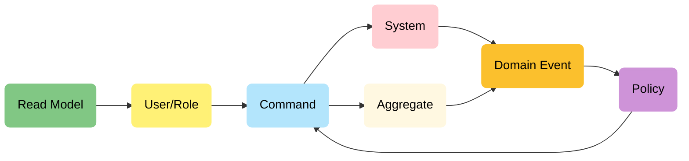
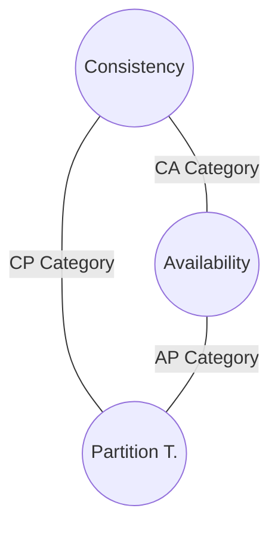
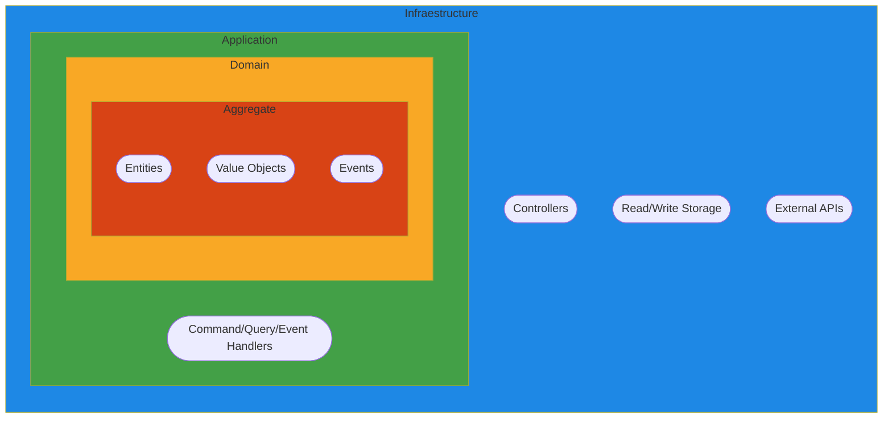
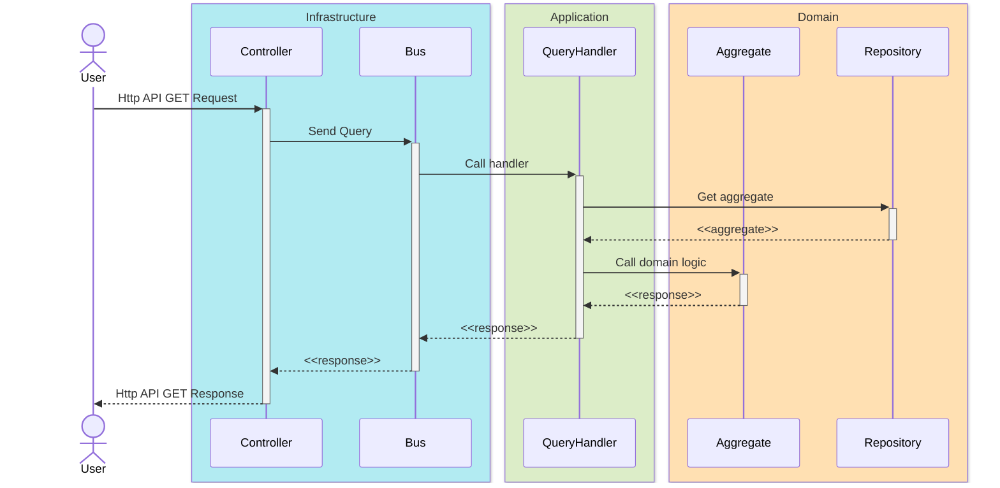
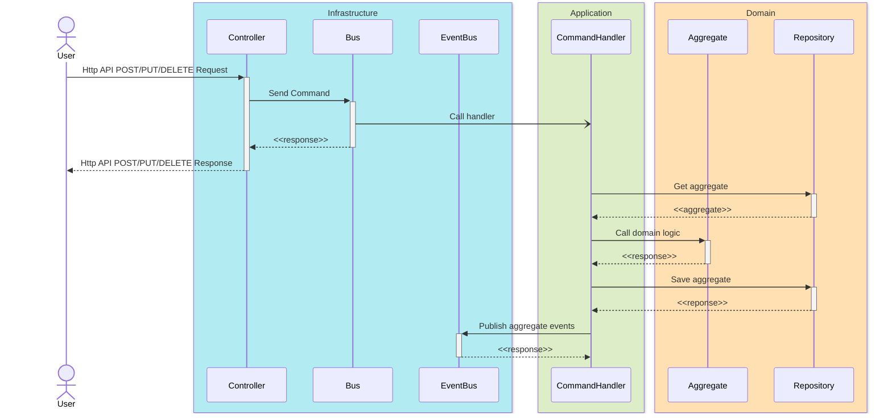
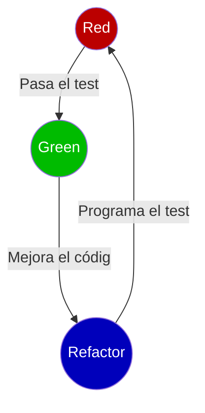

# DDD Repositorio de ejemplo

Este es un repositorio de ejemplo para demostrar conceptos de DDD, Arquitectura Hexagonal y CQRS.

# Domain Driven Design

Aproximación al desarrollo de software complejo.
- Se pone el foco en el dominio del problema y lo traslada al código.
- Se explora dicho dominio en colaboración con los expertos.
- Se habla en un lenguaje ubicuo dentro de un contexto limitado.

Documentación On-line:
- [DDD Reference](https://www.domainlanguage.com/wp-content/uploads/2016/05/DDD_Reference_2015-03.pdf)
- [DDD Crew](https://github.com/ddd-crew)
- [Virtual DDD](https://virtualddd.com/)

Libros:
- [Domain Driven Design](https://www.amazon.com/Domain-Driven-Design-Tackling-Complexity-Software/dp/0321125215)
- [Implementing Domain Driven Design](https://www.amazon.com/Implementing-Domain-Driven-Design-Vaughn-Vernon/dp/0321834577)
- [Domain Driven Desgin Distilled](https://www.amazon.com/Domain-Driven-Design-Distilled-Vaughn-Vernon-ebook/dp/B01JJSGE5S)
- [Patterns, Principles & Practices of DDD](https://www.amazon.com/Patterns-Principles-Practices-Domain-Driven-Design/dp/1118714709)
- [Leaning Domain Driven Design](https://www.amazon.com/Learning-Domain-Driven-Design-Aligning-Architecture/dp/1098100131)

## Diseño estratégico

En el diseño estratégico se trata de modelar el espacio del problema sin entrar a ninguna solución técnica, de manejan los conceptos de:
- **Domain**: El dominio del problema, limitado por el lenguaje ubicuo. No es igual el concepto expediente en el dominio de gestión académica que en el de administración electrónica. Debes clasificar los dominios encontrados según:
    - *Generic Domain*: Dominio genérico, presente en muchas otras organizaciones de todo tipo, puede externalizarse sin personalización, recursos humanos, contabilidad, marketing,...
    - *Supported Domain*: Dominio de soporte, más cercano al core del negocio, parcialmente externalizable, gestión académica, estudios propios,...
    - *Core Domain*: Dominio en el que debes concentrar todos tus esfuerzos ya que marca la diferencia con tus competidores
- **Lenguaje ubicuo**: Consensuado con los expertos del dominio si ellos lo llaman expediente la clase que lo modele debe llamarse igual, incluso parámetros URL de llamadas. Si detecto el mismo concepto expediente con diferente uso está claro que son dominios diferentes
- **Bounded context**: Donde cobra sentido el lenguaje utilizado, un subsistema en el que se aplica un modelo particular con una infraestructura dedicada, unos límites definidos y bajo la responsabilidad de un único equipo (autónomo)
- **Context mapping**: Relación entre los diferentes contextos, cuando tenga que relacionar dos contextos lo voy a hacer con mecanismos que determinarán mi grado de dependencia entre contextos y a su vez la relación entre los equipos responsables
    - *Customer/Supplier*: Relación proveedor/cliente cooperativa, con atención al cliente
    - *Open/Host Service*: Como el anterior pero con un lenguaje publicado (varios clientes), no hay dedicación al cliente
    - *Conformist*: Una relación en la que el cliente comparte el modelo no lo adapta, usa sus términos de lenguaje
    - *Anticorruption Layer*: Modelo del cliente aislado con un adaptador para traducción suele usarse para aislar legacy code
    - *Shared kernel*: Se comparte parte del modelado del dominio (código o tal vez la BD)
    - **Relación entre equipos**
        - *Upstream/Downstream*: Cuando un equipo (DW) es cliente de otro (UP) y puede verse afectado por sus cambios
        - *Mutually dependent*: Cuando existe dependencia en ambos sentidos entre los equipos
        - *Free*: Cuando los equipos no tienen dependencias

Existen algunas técnicas para llegar a extraer los bounded contexts y relaciones dentro de nuestro dominio.

### Event storming

Se empieza detectando los eventos de dominio para continuar recuperando los comandos (que originan los eventos) y los sistemas o agregados que procesan esos comandos (y generan los eventos). Los comandos pueden ser ejecutados por unos determinados usuarios o roles o por políticas procesadas a partir de los eventos generados. Tanto en un caso como otro puede ser necesario disponer de datos para tomar las decisiones que permitan lanzar los comandos.

## Diseño táctico

Una vez localizados los subdominios o bounded contexts debes plasmar en código los conceptos del lenguaje ubicuo utilizando diferentes conceptos:

- **Entity**: Esto no necesita mucha explicación, se trata de un elemento que tiene entidad y que lleva asociadas acciones de buscar, recuperar, guardar (datos + comportamiento)
    - *Persona*: El ejemplo habitual, si una persona cambia de DNI sigue siendo la misma persona. Aquí se ve claro el error cometido al modelar la entidad persona del dominio en nuestra base de datos, el DNI no es el identificador de esta entidad
- **Value Object**: Son objetos que no se comportan como entidades, puedo reemplazar un objeto por otro con los mismos atributos y no pasa nada. Además son inmutables si cambian se crean objetos nuevos.
    - *Dirección*: Este objeto con calle, número, código postal puedo reemplazarlo por otro con los mismos valores y no pasa nada. Si la dirección cambia no cambio la calle o el número, debo crear otro objeto dirección
- **Aggregate**: Se encargan de transaccionar el estado del sistema, pueden ser compuestos por una única entidad o por varias. Cuando lo conforman varias una de las entidades actúa como root y todas las interacciones son a través de ella
    - *Pedido y línea de pedido*: En este caso ambas entidades podrían formar un agregado y pedido actuaría como root, no necesito crear una clase AgregadoPedido la propia clase Pedido es la raíz del agregado
- **Repositorios**: Encargados de persistir y recuperar el estado de un agregado
- **Factorías**: Para crear las entidades del dominio (no usar new)
- **Eventos**: Hechos inmutables que publican los agregados al modificar su estado. Se escriben en pasado y se pueden persistir en un event hub
- **Comandos**: Acciones inmutables que desencadenan cambios en uno o más agregados. Se escriben en infinitivo y se transmiten por eventos o llamadas API rest
- **Servicios**: Cuando no está claro en qué entidad implementar el caso de uso se puede recurrir a un elemento auxiliar, pero no debe caerse en implementar todo en clases "servicio"

### Value Object

La idea es garantizar la integridad de estos objetos desde el momento en el que se crean, si una vez creados no se modifican estoy seguro de que serán siempre válidos. Debo huir de usar tipos primitivos para usar tipos específicos:
- Incluye la inmutabilidad si el tipo original no la incluye
- Controlo en el constructor todas las restricciones sobre el atributo: La longitud, el formato, los rangos, etc…
- No se exponen detalles de la implementación de mi dominio al exterior, retorna el valor con un método value que devuelve un tipo elegido, puedo cambiar el almacenamiento interno sin afectar a nada, haciendo la conversión en el método value
- Se convierten en un imán para encapsular lógica asociada a ellos
- Depende del contexto un billete puede ser una entidad o un value object

### Agregados

Hemos dicho que son los encargados de transaccionar el estado por lo que esta será la clave a la hora de decidir si varias entidades forman un agregado o no:
- **Invariante**: Si existe una regla que vincula ambos objetos que debe cumplirse obligatoriamente en todo momento conformarán un agregado
- **Consistencia eventual**: Siempre que pueda permitirme la consistencia eventual optaré por ella porque ayuda al rendimiento y simplifica
- **Negocio/UI**: Si el negocio me obliga a que dos elementos de la UI no puedan mostrarse nunca temporalmente inconsistentes tendré un agregado

Por regla general un caso de uso (una petición) solo debe incluir transacciones de un único agregado, si tienes casos de uso que modifican muchos agregados algo anda mal. Cada agregado tendrá su repositorio para gestionar su persistencia (incluso separado R/W). Además se encargan de publicar los eventos registrados a lo largo de su ejecución. Un bounded context puede contener varios agregados pero lo lógico será ubicarlos en módulos diferenciados, el secreto es mantenerse pequeño y respetar location transparency (no hacer suposiciones sobre la ubicación de un agregado puede estar en una API remota)

No es posible tener un sistema de base de datos distribuido que garantice las tres propiedades al mismo tiempo, solo se pueden garantizar dos:
- **Consistencia**: Capacidad de retornar siempre los datos más actualizados presentes en el sistema
- **Disponibilidad**: Capacidad de responder siempre satisfactoriamente a las peticiones de lectura sobre el sistema sin importar la consistencia de los datos
- **Tolerancia a particionamiento**: Se tolera sin perder funcionalidad una situación de falta de comunicación en parte del sistema

Esto nos deja ante la posibilidad de construir sistemas de datos distribuidos de 3 tipos:
- **CA Category**: Estos sistemas son inaceptables puesto que no es posible asumir que no vas a tener problemas de comunicación
- **CP Category**: Se ofrece consistencia y disponibilidad, ante un fallo de comunicación el sistema se bloquea o bloquea las operaciones de escritura mientras siga particionado para evitar las inconsistencias
- **AP Category**: No se garantiza la consistencia para permitir la tolerancia a fallos de comunicación y mantener el funcionamiento completo del sistema

Al final al construir un sistema distribuido realmente tienes que decidir entre dos opciones puesto que en cualquier caso debes ofrecer siempre la tolerancia al particionamiento, debes elegir qué sacrificar:
- **Disponibilidad**: Es lo que hemos hecho hasta ahora nuestros sistemas ante incomunicaciones se ven afectados
- **Consistencia**: Es lo que pretendemos hacer a futuro, empezar a tolerar el empleo de datos ligeramente desactualizados para hacer sistemas disponibles en todo momento

# Arquitectura Hexagonal

Arquitectura limpia ideal para reflejar los límites entre el dominio y la infraestructura. Los conceptos tácticos vistos en DDD encajan a la perfección en ella. Se basan en crear capas concéntricas:
- Situando el dominio en la capa más interior
- La infraestructura en la capa más exterior
- **No permitiendo dependencias de capas internas hacia capas externas**

Se obtienen varios beneficios:
- La lógica de negocio se mantiene al margen de cuestiones tecnológicas
- Maximiza la portabilidad haciendo más sencillo adaptar cambios tecnológicos

## Estructura de carpetas

En el proyecto puedes alojar diferentes módulos de tu dominio, no tienes porque mezclarlos. Se utiliza una carpeta **shared** para alojar el código común a todos los módulos *shared kernel*, incluye clases útiles.

- **ADAPTERS**: Carpeta de capa de infraestructura, incluye los adaptadores de interfaces definidas para satisfacer las necesidades de entrada/salida del dominio para determinadas soluciones técnicas. Una carpeta por implementación
    - **JPA**: Implementación JPA de los repositorios necesarios para almacenamiento
    - **REST**: Implementación con SpringBoot de Controladores REST
    - **Otros**: En el ejemplo fake y location son implementaciones mock de servicios
- **APPLICATION**: Carpeta de capa de aplicación, incluye comandos, queries y servicios
    - **Command**: Carpeta con la definición de los comandos y los manejadores de cada uno
    - **Query**: Carpeta con la definición de las queries y los manejadore de cada una
    - **Service**: Incluye servicios de más alto nivel que los servicios de dominio para resolver necesidades de los manejadores 
- **DOMAIN**: Carpeta de capa de dominio, incluye el modelo (agregados, entidades y value objects), eventos, factorías, políticas, repositorios y servicios.
    - **Event**: Eventos del dominio
    - **Factory**: Factorías para crear los objetos del dominio
    - **Modelo**: Aloja entidades y value objects, una de las entidades debe ser el agregado raíz
    - **Policy**: Políticas con patrón estrategia para resolver decisiones de la lógica del dominio
    - **Repository**: Interfaces de repositorio necesarias para recuperar agregados del dominio

# CQRS

Es el siguiente paso hacia la independencia, separar consultas de modificaciones:
- Puedo escalar de forma separada y crear modelos específicos para cada caso
- Se aumenta la seguridad un fallo en la parte de lectura no me provoca modificaciones
- Puede que solo necesite escrituras en el backoffice
- Puedo resolver problemas de API Composition, de una forma más optimizada, utilizando llamadas al BUS en lugar de vía HTTP
- Puedo aplicar decoradores a todos mis comandos por la firma común del handler, recopilar métricas o auditar por ejemplo

## Command/Query BUS

Un bus no es más que una abstracción de una colección de manejadores con la lógica necesaria para encaminar un determinado comando/query al handler adecuado (único por comando/query)

El controlador de entrada correspondiente será el encargado de recuperar los datos de la interfaz de entrada necesario, crear el comando necesario y enviarlo al bus. En caso de tratarse de un bus síncrono será capaz de retornar los datos devueltos por el comando o la query. Se recomienda utilizar buses asíncronos en comandos siempre que sea posible.

## Query

- Un simple DTO que sirve para trasladar al dominio la intención de obtener datos
- Retorna un resultado sin provocar efectos secundarios normalmente de forma síncrona
- El controlador de entrada lanza ese DTO al query bus y este lo remite al handler
- El **query handler** se encarga de:
    - Traducir los datos de entrada de la query a entidades/value objects del dominio
    - Recuperar los agregados y entidades necesarias utilizando los repositorios
    - Invocar a la lógica de negocio del agregado raíz para ejecutar la query y retornar el resultado
    - No es necesario persistir el agregado ni publicar eventos (no hay mutación del sistema)

## Command

- Un simple DTO que sirve para trasladar al dominio la intención de ejecutar una acción
- No retorna nada (void) sólo provoca un efecto secundario normalmente asíncrono (bus)
- El controlador de entrada lanza ese DTO al command bus y este lo remite al handler
- Puedo asumir picos de carga mejor si utilizo un bus asíncrono
- Debemos procurar su idempotencia *f(f(x)) = f(x)* siempre que sea posible (obligatorio para PUT/DELETE)
- El **command handler** se encarga de:
    - Traducir los datos de entrada del comando a entidades/value objects del dominio
    - Recuperar los agregados y entidades necesarias utilizando los repositorios
    - Invocar a la lógica de negocio del agregado raíz para ejecutar el comando 
    - Persistir el estado del agregado raíz para preservar el cambio de estado provocado por el comando
    - Publicar los eventos producidos por el agregado raíz una vez que se ha persistido con éxito

## Identificadores y validaciones

- Hemos mencionado que los comandos no retornan datos permitiendo así su asincronía
- ¿Cómo conoce el cliente el ID del recurso que acaba de crear con un comando?
    - Lo más simple es que el ID sea un valor más a facilitar por el cliente
    - Olvidar las secuencias o autoincrementados como identificadores
    - Utilizar UUIDs fáciles de crear en cualquier cliente y lenguaje
    - Se facilitan los test unitarios y mi generación no depende de la infraestructura 
    - Complicas la explotación de los fallos de seguridad broken access control
    - Obviamente habrá casos en los que deberé adaptarme a IDs generados en la base de datos, usar comandos síncronos
- Por la misma razón si quiero retornar al controller errores de datos de entrada debo de hacer validaciones por duplicado
    - Validar en la conversión de datos del comand/query handler (impide introducir datos inválidos al dominio)
    - Duplicar la validación en la creación de las queries y commands, para poder retornar errores a los usuarios aún usando bus asíncrono de comandos o para agrupar múltiples errores en uno

# Testing

Existen varios tipos de tests:
- **Estáticos**: Proporcionados por los analizadores estáticos de código (linters, sonarqube,...)
- **Unitarios**: Prueban el caso de uso directamente mockeando toda la infraestructura, valida la lógica del caso de uso y la colaboración con los adaptadores de salida
- **Integración**: Prueban las implementaciones de la infraestructura de salida (normalmente repositorios)
- **Aceptación/E2E**: Prueba todo desde el punto de vista del adaptador de entrada

Para dar soporte a los tests dispones de diferentes tipos de dobles de tests:
- **Dummy**: Usado para satisfacer dependencias sin relevancia para la ejecución
- **Stub**: Implementación alternativa a la real con unos valores fijos predeterminados
- **Spy**: Utilizada para comprobar si nuestro código invoca a cierto método de la interface
- **Mock**: Combina las características de stub y spy puede retornar valores según la entrada
- **Fake**: Una implementación completa con lógica de negocio (ej. una InMemoryDB)

## Test Unitarios

En nuestro caso el objetivo sería probar el funcionamiento de los command y query handler, debes usar un doble para cualquier servicio que requieran infraestructura, y comprobar en todo caso las interacciones. Estarías probando capa de aplicación y dominio.

De este modo evitas que un cambio en la implementación de un adaptador concreto rompa los tests unitarios, y tampoco estás obligado a modificarlos si añades una implementación nueva a una interfaz existente.

### TDD

Hacer los tests antes que el código de producción. Si no tienes un test no sabes qué debe hacer tu código de producción.

Reglas principales:
- **No escribirás código de producción sin escribir un test antes que falle**
- **No escribirás más de un test unitario suficiente para fallar**
- **No escribirás más código del necesario para pasar el test**

Fases:
- **Red**: Escribir un test que falle, normalmente unitario pero puede ser de integración
- **Green**: Implementar el código mínimo para que el test pase
- **Refactor**: Una vez que el test pasa estás en posición de optimizar el código y mejorarlo
    - La fase realmente importante, nadie hace código bien a la primera
    - Tener tests permite abordar refactorizaciones para mejorar el código y mejorar su mantenibilidad

Estrategias de rojo a verde (hay muchas más):
- **Implementación falsa**: Empiezas retornando las constantes para los casos de prueba y poco a poco deduces el algoritmo necesario que funciona para el caso general
- **Implementación obvia**: Cuando tienes problemas muy obvios puedes optar por implementar la solución directamente
- **Triangulación**: Se mezcla una implementación obvia del caso más simple con implementaciones falsas de los más complejos hasta obtener la implementación final

Patrón Object Mother:
- Cuando escribes tests es complicado mantener la semántica y no perderte entre el código que prepara o prueba los diferentes casos de uso
- Crea factorías semánticas para evitarlo, por ejemplo un método factoría "crearUsuarioMayorDeEdad" deja clara la intención de la prueba

## Test Integración

Se trata de probar las diferentes implementaciones de infraestructura utilizadas, ya sean repositorios o APIs externas. Lo normal es probar las implementaciones de salida, las de entrada se pueden hacer en los test de aceptación.

La gran ventaja es que cuando añades o modificas un adaptador solo se ven afectados estos tests unitarios.

## Test Aceptación

Se trata de probar todo de principio a fin, en principio sin usar dobles de tests pero claramente en la parte de la persistencia no siempre es viable. El principal objetivo es testear los adaptadores de entrada (controladores rest). Se puede utilizar sintaxis gherkin para utilizarlos como documentación de tu servicio.

### Acceptance TDD

- Trata de utilizar los tests de aceptación como documentación viva
- Dentro de un ciclo de ATDD en la fase de desarrollo de la especificación habría uno o varios ciclos TDD
- Los tests a escribir parten de las historias de usuario (Example Mapping)
- Los tests se escriben con términos del lenguaje ubicuo entendible por expertos del dominio
- Utiliza el lenguaje gherkin (cucumber)
    - **Característica**: Funcionalidad a probar
    - **Escenario**: Escenario a probar (ejemplo/caso de uso) 
    - **Dado**: Pre-condición inicial
    - **Cuando**: Acción sobre el sistema
    - **Entonces**: Post-condición final
    - **Y, Pero**: Para mayor legibilidad

